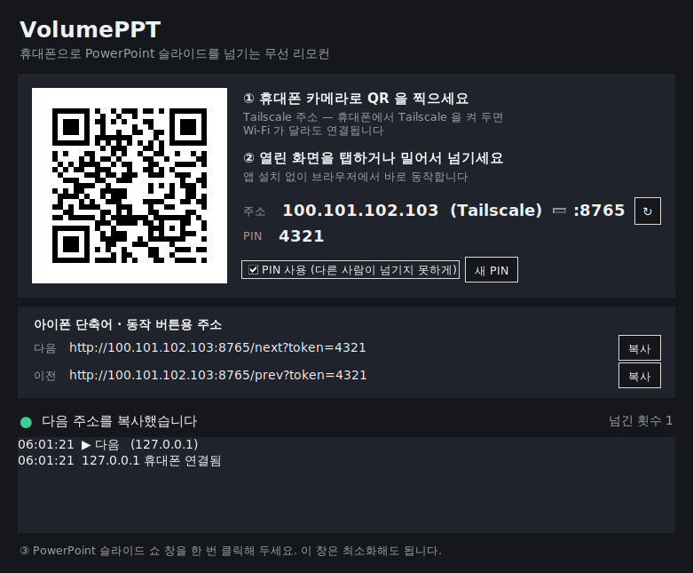

# VolumePPT

스마트폰의 **볼륨 버튼**을 무선 프레젠테이션 리모컨으로 바꿔 주는 프로그램입니다.
따로 리모컨을 살 필요 없이, 늘 가지고 다니는 휴대폰으로 발표 슬라이드를 넘길 수 있습니다.

| 휴대폰 버튼 | 슬라이드 |
|:---:|:---:|
| 볼륨 ▲ (업) | 다음 ▶ |
| 볼륨 ▼ (다운) | ◀ 이전 |

- **안드로이드 · 아이폰** 모두 지원
- PC 는 **Windows · Mac** 지원, 설치 없이 실행 파일 하나로 동작
- **QR 코드**로 연결 — 주소나 PIN 을 직접 입력할 필요 없음
- PowerPoint 뿐 아니라 **Keynote, Google Slides, PDF 뷰어** 등 방향키로 넘어가는 프로그램이면 모두 사용 가능
- 앱이 없어도 휴대폰 브라우저의 화면 버튼으로 사용 가능



---

## 빠른 시작

### 1. PC 에서 실행기 켜기

| PC | 받을 파일 | 실행 |
|---|---|---|
| Windows | `VolumePPT.exe` | 더블클릭 |
| Mac | `VolumePPT.app` | 우클릭 → 열기 |

실행하면 위 그림처럼 **QR 코드, 주소, PIN** 이 표시된 창이 뜹니다.

### 2. 휴대폰 연결하기

1. 휴대폰을 **PC 와 같은 Wi-Fi** 에 연결합니다.
2. 휴대폰 **카메라로 QR 코드**를 찍고 뜨는 링크를 엽니다.
3. 열린 화면에서 **[📱 앱으로 연결]** 을 누릅니다. 앱에 주소와 PIN 이 자동으로 입력되고 `✅ 연결됨` 이 표시됩니다.
   - 안드로이드에 앱이 아직 없다면 같은 화면의 **[안드로이드 앱 받기]** 를 눌러 설치하세요. 앱이 PC 실행기 안에 들어 있어서 인터넷이 없어도 받을 수 있습니다.
   - 앱 없이 그 화면의 **[다음 ▶] [◀ 이전]** 버튼으로 바로 넘겨도 됩니다.

### 3. 발표하기

1. PowerPoint 에서 **슬라이드 쇼**를 시작하고, 슬라이드 쇼 화면을 **한 번 클릭**해 둡니다.
2. 휴대폰 앱을 켜 둔 채로 **볼륨 ▲ / ▼** 를 누르면 슬라이드가 넘어갑니다.

PC 실행기 창은 최소화해도 계속 동작합니다. 창에서 넘긴 횟수와 기록을 확인할 수 있습니다.

---

## 다운로드

GitHub 저장소의 **Actions → Build VolumePPT** 에서 가장 최근의 성공한 실행을 열고, 아래쪽 **Artifacts** 에서 받습니다.

| Artifact | 내용 |
|---|---|
| `VolumePPT-Windows` | `VolumePPT.exe` — Windows 실행기 (안드로이드 앱 포함) |
| `VolumePPT-Mac` | `VolumePPT-mac.zip` → `VolumePPT.app` — Mac 실행기 (안드로이드 앱 포함) |
| `VolumePPT-Android` | `VolumePPT.apk` — 안드로이드 앱만 따로 |

> Artifacts 는 GitHub 로그인이 필요하고 90일 뒤 삭제됩니다.
> `v1.0` 같은 태그를 푸시하면 같은 파일이 **Releases** 페이지에 자동으로 올라가 누구나 계속 받을 수 있습니다.
> ```bash
> git tag v1.0 && git push origin v1.0
> ```

### 아이폰 앱

앱스토어에 배포되어 있지 않아서 **Mac + Xcode** 로 직접 설치해야 합니다.

```bash
brew install xcodegen
cd ios
xcodegen generate
open VolumePPT.xcodeproj
```

Xcode 에서 *Signing & Capabilities* 의 Team 에 본인 Apple ID 를 선택하고 아이폰을 연결해 실행합니다.
처음 실행할 때 **로컬 네트워크 접근 허용**을 눌러 주세요.

아이폰 앱이 없어도 QR → 웹 리모컨의 화면 버튼으로는 바로 사용할 수 있습니다.

---

## 처음 한 번만 필요한 설정

| 기기 | 할 일 |
|---|---|
| Windows | "Windows의 PC 보호" 창이 뜨면 **추가 정보 → 실행**. 방화벽 알림이 뜨면 **개인 네트워크 허용** |
| Mac | 앱을 **우클릭 → 열기**. *시스템 설정 → 개인정보 보호 및 보안 → 손쉬운 사용* 에서 VolumePPT 허용 (키 입력에 필요) |
| 안드로이드 | APK 설치 시 **출처를 알 수 없는 앱 설치 허용** |
| 아이폰 | 앱 첫 실행 시 **로컬 네트워크 허용**. *설정 → 일반 → VPN 및 기기 관리* 에서 개발자 앱 신뢰 |

---

## 문제 해결

| 증상 | 해결 방법 |
|---|---|
| `❌ PC에 연결할 수 없습니다` | 휴대폰과 PC 가 **같은 Wi-Fi** 인지 확인하세요. 회사/학교/카페 Wi-Fi 는 기기끼리 통신을 막는 경우가 많습니다. 이때는 **휴대폰 핫스팟에 PC 를 연결**해서 쓰세요. |
| 연결은 되는데 슬라이드가 안 넘어감 | PowerPoint **슬라이드 쇼 창을 한 번 클릭**해서 활성 창으로 만드세요. Mac 은 *손쉬운 사용* 권한을 확인하세요. |
| `❌ PIN 이 맞지 않습니다` | PC 에서 PIN 이 바뀌었습니다. PC 화면의 QR 을 다시 찍으세요. |
| 볼륨 버튼을 눌러도 반응 없음 | 휴대폰 앱이 **화면에 떠 있어야** 합니다. 다른 앱으로 전환했거나 화면이 꺼졌다면 앱을 다시 여세요. |
| 실행기에서 "포트를 사용할 수 없습니다" | VolumePPT 가 이미 켜져 있습니다. 작업 표시줄/독에서 기존 창을 찾거나 닫고 다시 실행하세요. |
| PC 에 IP 주소가 여러 개 표시됨 | 주소 옆 목록에서 휴대폰과 같은 Wi-Fi 의 주소(보통 `192.168.x.x`)를 고르세요. QR 도 함께 바뀝니다. |

---

## 알아 두기

- 휴대폰 앱이 켜져 있는 동안 볼륨 버튼은 휴대폰 음량을 바꾸지 않고 리모컨으로만 쓰입니다.
- 앱이 켜져 있는 동안에는 휴대폰 화면이 자동으로 꺼지지 않습니다.
- **PIN** 은 같은 Wi-Fi 에 있는 다른 사람이 슬라이드를 넘기지 못하게 막아 줍니다. 실행기 창에서 끄거나 [새 PIN] 으로 바꿀 수 있습니다. PIN 은 PC 에 저장되므로 다음에 실행해도 그대로입니다.
- 블루투스 프레젠터나 셔터 리모컨(Page Up/Down, 미디어 키)을 휴대폰에 연결해도 같이 동작합니다.
- 인터넷 연결은 필요 없습니다. 휴대폰과 PC 가 같은 네트워크에만 있으면 됩니다.

---

## 작동 원리

```
┌────────────┐   같은 Wi-Fi (HTTP)    ┌──────────────────┐   → / ← 키 입력   ┌────────────┐
│  휴대폰 앱  │ ─────────────────────▶ │  PC 실행기         │ ────────────────▶ │ PowerPoint │
│  볼륨 ▲ / ▼ │   /next  /prev         │  VolumePPT.exe    │                   │            │
└────────────┘                        └──────────────────┘                   └────────────┘
```

- **안드로이드**: 앱이 볼륨 키 이벤트를 직접 받아서 시스템 음량 대신 PC 로 신호를 보냅니다.
- **아이폰**: iOS 는 볼륨 버튼 이벤트를 앱에 주지 않기 때문에, 시스템 음량이 바뀌는 것을 감지해 ▲/▼ 를 판단하고 음량을 다시 중간값으로 되돌립니다. 카메라 앱들이 셔터 버튼에 쓰는 방식과 같습니다.
- **PC 실행기**: 작은 웹 서버를 켜고 요청이 오면 → / ← 키를 누릅니다. 같은 서버가 웹 리모컨 화면과 안드로이드 APK 도 제공합니다.
- **QR 코드**: `http://PC주소:8765/?token=PIN` 이 들어 있습니다. 웹 화면의 [앱으로 연결] 은 `volumeppt://connect?host=...&token=...` 링크로 앱을 열어 설정을 자동으로 채웁니다.

### PC 실행기 API

| 요청 | 동작 |
|---|---|
| `GET /` | 웹 리모컨 화면 |
| `GET /next?token=PIN` | 다음 슬라이드 (→ 키) |
| `GET /prev?token=PIN` | 이전 슬라이드 (← 키) |
| `GET /ping?token=PIN` | 연결 확인 |
| `GET /app.apk` | 안드로이드 앱 다운로드 (실행 파일에 포함된 경우) |

PIN 을 끈 경우 `token` 은 필요 없습니다. PIN 이 틀리면 `403` 을 돌려줍니다.

---

## 프로젝트 구조

```
VolumePPT/
├── pc/
│   ├── VolumePPT.py        # PC 통합 실행기 (창 + 서버 + QR + 웹 리모컨 + 키 입력)
│   └── requirements.txt
├── android/                # 안드로이드 앱 (Java, Android 5.0 이상)
│   └── app/src/main/java/com/volumeppt/remote/MainActivity.java
├── ios/                    # 아이폰 앱 (SwiftUI, iOS 15 이상)
│   ├── project.yml         # XcodeGen 설정
│   └── VolumePPT/
├── docs/launcher.png
└── .github/workflows/build.yml   # APK, Windows exe, Mac app 자동 빌드
```

## 개발자용

### PC 실행기를 소스에서 실행

Python 3.8 이상이 필요합니다.

```bash
cd pc
pip install -r requirements.txt
python VolumePPT.py              # 창으로 실행
python VolumePPT.py --nogui      # 창 없이 콘솔에서 실행 (터미널에 QR 표시)
```

| 옵션 | 설명 |
|---|---|
| `--port 9000` | 포트 변경 (기본 8765) |
| `--no-pin` | PIN 없이 실행 |
| `--nogui` | 창 없이 콘솔 모드 |
| `--dry-run` | 키를 누르지 않고 기록만 표시 (테스트용) |

설정(포트, PIN)은 `~/.volumeppt.json` 에 저장됩니다.

### 안드로이드 앱 빌드

Android Studio 로 `android/` 폴더를 열거나:

```bash
cd android
./gradlew assembleRelease
# → app/build/outputs/apk/release/app-release.apk
```

### 자동 빌드

`android/`, `pc/` 가 바뀐 채로 푸시하면 GitHub Actions 가 다음 순서로 빌드합니다.

1. 안드로이드 APK 빌드
2. APK 를 넣어서 Windows `VolumePPT.exe`, Mac `VolumePPT.app` 빌드 (PyInstaller)
3. `v*` 태그인 경우 세 파일을 Releases 에 업로드
