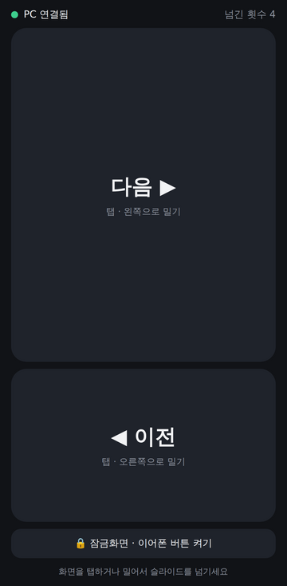

# VolumePPT

**휴대폰으로 PowerPoint 슬라이드를 넘기는 무선 리모컨**

휴대폰에 앱을 설치할 필요가 없습니다. PPT 를 띄운 컴퓨터에서 실행기를 켜고, 화면의 QR 코드를 휴대폰 카메라로 찍으면 바로 리모컨이 됩니다.

<p align="center">
  
  &nbsp;&nbsp;
  
</p>

## ⬇️ 다운로드

PPT 를 띄울 **컴퓨터**에 받아서 실행하세요. 휴대폰에는 아무것도 설치하지 않아도 됩니다.

| 컴퓨터 | 다운로드 |
|:---:|:---:|
| 🪟 **Windows** | [**VolumePPT.exe 다운로드**](https://github.com/psinserver-jpg/VolumePPT/releases/latest/download/VolumePPT.exe) |
| 🍎 **Mac** | [**VolumePPT-mac.zip 다운로드**](https://github.com/psinserver-jpg/VolumePPT/releases/latest/download/VolumePPT-mac.zip) |

설치 과정 없이 받은 파일을 바로 실행하면 됩니다.

---

## 사용법

### ① 컴퓨터에서 실행기 켜기
받은 `VolumePPT.exe` (Mac 은 압축을 풀고 `VolumePPT.app`) 를 실행하면 **QR 코드**가 뜹니다.

### ② 휴대폰 카메라로 QR 찍기
휴대폰을 컴퓨터와 **같은 Wi-Fi** 에 연결하고, 기본 카메라로 QR 을 찍어 뜨는 링크를 엽니다.
리모컨 화면이 열리고 상단에 🟢 **PC 연결됨** 이 표시됩니다.

### ③ 발표하기
PowerPoint 에서 **슬라이드 쇼**를 시작하고 슬라이드 화면을 **한 번 클릭**해 둡니다. 그다음 휴대폰으로 넘기면 됩니다.

| 휴대폰에서 | 슬라이드 |
|---|---|
| **[다음 ▶]** 탭 · 화면을 **왼쪽으로** 밀기 | 다음 |
| **[◀ 이전]** 탭 · 화면을 **오른쪽으로** 밀기 | 이전 |
| 잠금화면 / 알림창의 **⏭ ⏮** · 이어폰 버튼 | 다음 / 이전 (아래 참고) |
| 블루투스 프레젠터 · 셔터 리모컨 | 다음 / 이전 |

#### 🔒 화면을 끈 채로 넘기기
리모컨 화면 아래 **[🔒 잠금화면 · 이어폰 버튼 켜기]** 를 누르면 소리 없는 오디오가 재생됩니다.
이 상태에서는 휴대폰 화면을 꺼도 **잠금화면의 ⏭ ⏮ 버튼**이나 **이어폰 버튼**으로 슬라이드를 넘길 수 있습니다.

#### 📲 홈 화면에 추가 (선택)
리모컨 화면에서 브라우저 메뉴의 **홈 화면에 추가**를 누르면 앱처럼 아이콘으로 열 수 있습니다.
다만 컴퓨터의 IP 주소가 바뀌면 QR 을 다시 찍어야 합니다.

---

## 처음 한 번만

| 상황 | 할 일 |
|---|---|
| Windows 에서 "Windows의 PC 보호" 창 | **추가 정보 → 실행** (서명되지 않은 프로그램이라 나오는 경고) |
| Windows 방화벽 알림 | **개인 네트워크 허용** 체크 후 **허용** |
| Mac 에서 "확인되지 않은 개발자" | 앱을 **우클릭 → 열기 → 열기** |
| Mac 에서 슬라이드가 안 넘어감 | *시스템 설정 → 개인정보 보호 및 보안 → 손쉬운 사용* 에서 **VolumePPT 허용** |

---

## 문제 해결

| 증상 | 해결 방법 |
|---|---|
| QR 을 찍었는데 페이지가 안 열림 / 🔴 **PC 에 연결할 수 없습니다** | 휴대폰과 컴퓨터가 **같은 Wi-Fi** 인지 확인하세요. 휴대폰의 모바일 데이터만 켜져 있으면 안 됩니다. 회사·학교·카페 Wi-Fi 는 기기끼리 통신을 막는 경우가 많으니, 그때는 **휴대폰 핫스팟에 컴퓨터를 연결**하세요. |
| 🟢 연결됨인데 슬라이드가 안 넘어감 | PowerPoint **슬라이드 쇼 화면을 한 번 클릭**해서 맨 앞 창으로 만드세요. Mac 은 *손쉬운 사용* 권한을 확인하세요. |
| 🔴 **PIN 이 맞지 않습니다** | 컴퓨터에서 PIN 이 바뀌었습니다. 컴퓨터 화면의 QR 을 다시 찍으세요. |
| 실행기에 "포트를 사용할 수 없습니다" | VolumePPT 가 이미 켜져 있습니다. 기존 창을 찾거나 닫고 다시 실행하세요. |
| 실행기에 주소가 여러 개 | 주소 목록에서 휴대폰과 같은 Wi-Fi 의 주소(보통 `192.168.x.x`)를 고르세요. QR 도 함께 바뀝니다. |
| 잠금화면 버튼이 안 보임 | 리모컨 화면의 **[🔒 잠금화면 · 이어폰 버튼 켜기]** 를 먼저 눌러야 합니다. 브라우저·기종에 따라 지원되지 않을 수 있습니다. |

---

## 알아 두기

- **PowerPoint 외에도** Keynote, Google Slides, PDF 뷰어 등 키보드 방향키(→ ←)로 넘어가는 프로그램이면 모두 동작합니다.
- **인터넷 연결은 필요 없습니다.** 휴대폰과 컴퓨터가 같은 네트워크에만 있으면 됩니다.
- **PIN** 은 같은 Wi-Fi 의 다른 사람이 슬라이드를 넘기지 못하게 막아 줍니다. QR 에 들어 있어서 직접 입력할 필요는 없고, 실행기에서 끄거나 [새 PIN] 으로 바꿀 수 있습니다.
- 실행기 창은 **최소화해도** 계속 동작합니다.

### 휴대폰 볼륨 버튼으로 넘기고 싶다면 (선택)

휴대폰 브라우저는 보안상 웹 페이지가 **볼륨 버튼을 받을 수 없게** 막혀 있습니다. 볼륨 버튼을 꼭 쓰고 싶다면 전용 앱을 설치하세요.

- **안드로이드**: [VolumePPT.apk 다운로드](https://github.com/psinserver-jpg/VolumePPT/releases/latest/download/VolumePPT.apk) 후 설치 (출처를 알 수 없는 앱 허용 필요). 리모컨 화면 아래의 **[볼륨버튼 앱(선택)]** 으로도 컴퓨터에서 바로 받을 수 있습니다.
- **아이폰**: 앱스토어 배포가 없어 Mac + Xcode 로 직접 빌드해야 합니다 (`ios/` 폴더, 아래 개발자용 참고).

앱에서는 볼륨 ▲ = 다음, 볼륨 ▼ = 이전입니다.

---

## 작동 원리

```
┌──────────────┐    같은 Wi-Fi (HTTP)    ┌──────────────────┐   → / ← 키 입력   ┌────────────┐
│ 휴대폰 브라우저 │ ─────────────────────▶ │  PC 실행기         │ ────────────────▶ │ PowerPoint │
│  웹 리모컨     │   /next  /prev          │  VolumePPT.exe    │                   │            │
└──────────────┘                         └──────────────────┘                   └────────────┘
```

- PC 실행기가 작은 웹 서버를 켜고, 휴대폰이 보낸 요청에 따라 → / ← 키를 누릅니다.
- 휴대폰 리모컨 화면도 이 실행기가 직접 제공하므로 앱 설치나 인터넷이 필요 없습니다.
- QR 코드에는 `http://컴퓨터IP:8765/?token=PIN` 이 들어 있습니다. PIN 은 휴대폰 브라우저에 저장되고 주소창에서는 지워집니다.
- 잠금화면 버튼은 브라우저의 Media Session 기능을 이용합니다.

| 요청 | 동작 |
|---|---|
| `GET /` | 웹 리모컨 화면 |
| `GET /next?token=PIN` | 다음 슬라이드 (→ 키) |
| `GET /prev?token=PIN` | 이전 슬라이드 (← 키) |
| `GET /ping?token=PIN` | 연결 확인 |
| `GET /app.apk` | 안드로이드 볼륨버튼 앱 (실행기에 포함된 경우) |

---

## 개발자용

### 프로젝트 구조

```
VolumePPT/
├── pc/VolumePPT.py             # PC 실행기 (창 + QR + 서버 + 웹 리모컨 + 키 입력, 파일 하나)
├── android/                    # (선택) 안드로이드 볼륨버튼 앱
├── ios/                        # (선택) 아이폰 볼륨버튼 앱 — XcodeGen 프로젝트
├── docs/                       # README 이미지
└── .github/workflows/build.yml # exe · app · apk 자동 빌드 및 릴리스
```

### 소스에서 실행

Python 3.8 이상이 필요합니다.

```bash
cd pc
pip install -r requirements.txt
python VolumePPT.py              # 창으로 실행
python VolumePPT.py --nogui      # 창 없이 실행 (터미널에 QR 표시)
```

| 옵션 | 설명 |
|---|---|
| `--port 9000` | 포트 변경 (기본 8765) |
| `--no-pin` | PIN 없이 실행 |
| `--nogui` | 창 없이 콘솔 모드 |
| `--dry-run` | 키를 누르지 않고 기록만 표시 (테스트용) |

설정(포트, PIN)은 `~/.volumeppt.json` 에 저장됩니다.

### 새 버전 배포

`android/`, `pc/` 를 바꿔 푸시하면 GitHub Actions 가 안드로이드 APK → (APK 를 포함한) Windows exe · Mac app 순서로 빌드합니다.
버전 태그를 푸시하면 세 파일이 **Releases** 에 올라가고, 위의 다운로드 링크가 자동으로 새 버전을 가리킵니다.

```bash
git tag v1.1.0
git push origin v1.1.0
```

### 아이폰 볼륨버튼 앱 빌드

```bash
brew install xcodegen
cd ios && xcodegen generate && open VolumePPT.xcodeproj
```

Xcode 의 *Signing & Capabilities* 에서 본인 Apple ID 팀을 선택하고 아이폰에 실행합니다.
